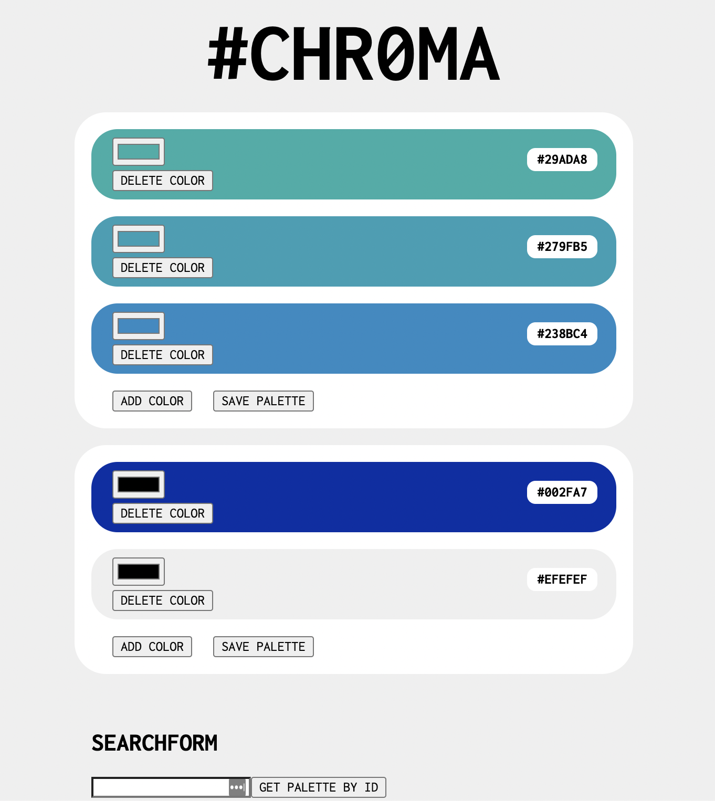

# #CHR0MA

The developer's design tool. 

Working with color codes can create unnecessary burdens: 
- Digging through project files to reuse that perfect color
- Going back to your stylesheet to adjust a couple digits up or down (save.. page reloads.. still not right.. repeat)
- Installing a color picker tool to reference schemes in the wild

Chroma makes it easier by providing a playground to ideate quickly and easily. See colors side by side and look for the perfect hue in real time as you move the selector. Use the built in color picker when you need to reference client materials or some other source of inspiration. Save palettes you use (or want to use !) in your visual library for you to reference whenever.

 

## Authors

- [@Ali Ziel](https://www.github.com/aliziel)
- [@Chris Ejercito](https://github.com/chris-paul-ejercito)
- [@JC Fernandez](https://github.com/jorgecarlosfernandez)
- [@Tobey Forsman](https://github.com/yebot)

  